# solarGain

How much of your AC bill is really the roof? solarGain pulls temperature, solar production,
and AC power history out of Home Assistant's recorder and renders one self-contained
`dashboard.html`. No server, no chart library, no cloud, no dependencies beyond Python.

**[Demo dashboard](https://solargain.gutentag.world/demo.html)** (synthetic data, nothing to
connect) · **[User guide](https://solargain.gutentag.world/user-guide.html)** ·
**[Site](https://solargain.gutentag.world)**



## What you get

- **The attic heat tax, measured.** Attic vs outdoor vs every room on one clock, with the
  attic's solar-driven excess shaded and timestamped. Hot attics typically peak 20 to 30°F
  above the outside air and radiate into bedrooms long after sunset.
- **Your solar array as a sunshine meter.** PV production is the irradiance signal a
  first-order thermal model fits against (time constant grid-searched, fit quality printed).
- **Upgrade scenarios fitted to your house, not a brochure.** What a ridge vent, R-38
  insulation, or a radiant barrier would do to the hottest day in range, with uncertainty
  bands and editable cost assumptions for the payback math.
- **AC truth from smart plugs.** Power derived from cumulative energy sensors gives run
  bands, per-unit kWh, and how much of it overlapped solar production.
- Wind-vs-attic residuals, per-room small multiples on a shared scale, and a plain-language
  "what the data says" summary. Colorblind-safe by construction: line identity is carried by
  dash pattern and weight, never hue alone.

## Quickstart

Requirements: Python 3.9+, a Home Assistant instance, and at minimum an outdoor temperature
sensor, an attic temperature sensor, and a solar production entity.

```bash
cp entities.example.py entities.py   # describe your sensors (friendly names)
cp .env.example .env                 # paste a long-lived HA token, set HASS_URL
./run.sh                             # fetch history, build, open dashboard.html
```

`./run.sh --mock` builds the dashboard from synthetic data first, so you can see everything
working before touching a real house. `--days N` limits the fetch window.

`entities.py` and `.env` are gitignored on purpose: they describe your home and never
belong in a commit. The [user guide](https://solargain.gutentag.world/user-guide.html)
covers the sensor map, what every card means, and the model assumptions.

## Files

- `entities.example.py` — sensor map template; copy to `entities.py` and edit
- `fetch_history.py` — resolves entity IDs, pulls history, downsamples to 10-min means → `data/history.json`
- `build_dashboard.py` — injects the JSON into `dashboard_template.html` → `dashboard.html`
- `dashboard_template.html` — all chart code (vanilla SVG, no dependencies)
- `docs/build_card.py` — regenerates the shareable summary card from the same data
- `public/` — this repo's GitHub Pages site (landing, guide, demo)

## License

MIT
